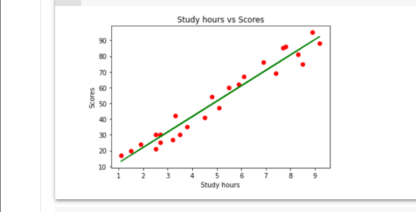
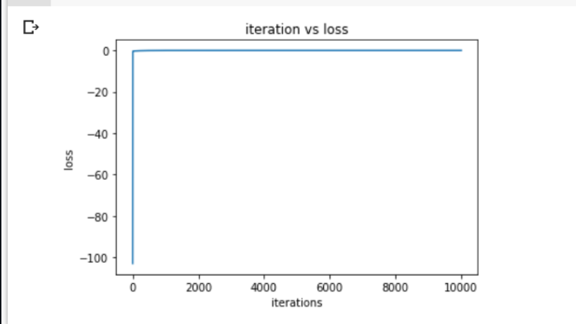

# Implementation-of-Linear-Regression-Using-Gradient-Descent

## AIM:
To write a program to implement the linear regression using gradient descent.

## Equipments Required:
1. Hardware – PCs
2. Anaconda – Python 3.7 Installation / Moodle-Code Runner

## Algorithm
1. Import necessary library in python
2. Create a new variable to read a CSV-FILE
3. Using training and test values on data-set, predict the linear line .
4. program end

## Program:
```
/*
Program to implement the linear regression using gradient descent.
Developed by: AAKASH S
RegisterNumber:  212221240001
*/
import pandas as pd
import matplotlib.pyplot as plt
data=pd.read_csv("/content/student_scores.csv")
data.head()
data.tail()
data.isnull().sum()
#storing data to variable
X=data.Hours
Y=data.Scores
print(X)
print(Y)
#defining variables
n=len(X)
m=0
c=0
L=0.01
loss=[]
for i in range(10000):
    ypred = m*X + c
    MSE = (1/n) * sum((ypred - Y)*2)
    dm = (2/n) * sum(X*(ypred-Y))
    dc = (2/n) * sum(ypred-Y)
    c = c-L*dc
    m = m-L*dm
    loss.append(MSE)
print(m,c)
#Plotting Linear Regression Graph
ypred=m*X+c
plt.scatter(X,Y,color="red")
plt.plot(X,ypred,color="green")
plt.xlabel("Study hours")
plt.ylabel("Scores")
plt.title("Study hours vs Scores")
#Graph between iteration Vs loss
plt.show()plt.title("study iteration vs loss")
plt.plot(loss) 
plt.xlabel("iterations") 
plt.ylabel("loss") 
plt.show()
```


## Output:

# Training data

# Testing data


## Result:
Thus the program to implement the linear regression using gradient descent is written and verified using python programming.
